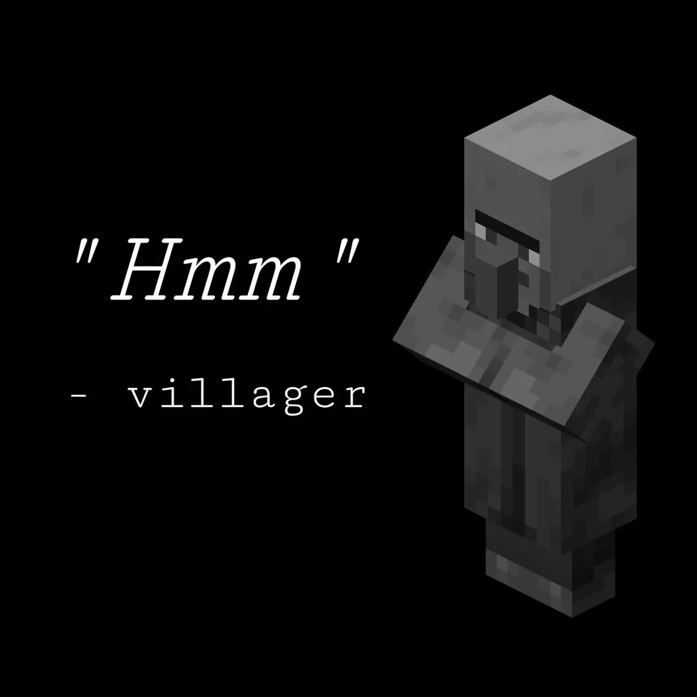

<!-- font_size: 3 -->

C'est quoi le meilleur langage pour... ?
===
<!-- new_lines: 3 -->

<!-- end_slide -->
<!-- font_size: 3 -->

La réalité du terrain
===

<!-- pause -->
- **10%** Écrire du code
<!-- pause -->
- **15%** Essayer de faire comprendre au product manager (ou au client) que le ticket #125 ne ne prend pas **QUE** 3h
<!-- pause -->
- **75%** NullPointerException at line 55
<!-- pause -->

<!-- new_lines: 1 -->
*TypeError: Cannot read properties of undefined*  
*Segmentation fault (core dumped)*  
*thread 'main' panicked*  
*Fatal error: Attempt to access property on null*  
*...*

<!-- end_slide -->

<!-- font_size: 3 -->
Des trucs absurdes… mais qui tournent
===

<!-- font_size: 2 -->

* **Minecraft** développé avec **Java**
  * *Configuration minimale: 2000€*
<!-- pause -->
<!-- new_lines: 1 -->
* **Le backend de Facebook** développé avec **PHP** *(avec HHVM)*
  * *Askip c'est un langage mort depuis 15 ans*
<!-- pause -->
<!-- new_lines: 1 -->
* **Le backend de Whatsapp** développé avec **Erlang**
  * *C'est le même langage qui propulse les feux rouges*
<!-- pause -->
<!-- new_lines: 1 -->
* **Le RER A (Île-de-France)** développé avec **COBOL** et **Fortran**
  * *...quand ton passe Navigo dépend d’un mainframe IBM des années 70*
<!-- pause -->
<!-- new_lines: 1 -->
* **La majorité des banques & assurances** utilisent **COBOL**
  * *Il y a plus de COBOL en prod aujourd’hui qu’en 1980... Et plus personne ne sait le maintenir*

<!-- end_slide -->

<!-- font_size: 3 -->
Le bon langage, c’est celui qui coche les bonnes cases
===

<!-- font_size: 2 -->

* **L'équipe le connaît**
  * Moins de bugs, montée en charge rapide
<!-- pause -->
<!-- new_lines: 1 -->
* **Il est déjà en place**
  *	Moins de friction, moins de coût
<!-- pause -->
<!-- new_lines: 1 -->
* **Il est maintenable dans le temps**
  * On pense à la personne qui passera derrière
<!-- pause -->
<!-- new_lines: 1 -->
* **Il a une bonne communauté**
  * Stack Overflow = support non-officiel mais vital
<!-- pause -->
<!-- new_lines: 1 -->
* **Il fait le job**
  * Si la prod tourne, on a déjà gagné

<!-- end_slide -->

<!-- font_size: 3 -->
Conclusion
===
<!-- new_lines: 2 -->

<!-- end_slide -->

<!-- font_size: 3 -->
Conclusion
===

<!-- alignment: center -->
<!-- new_lines: 4 -->
<!-- font_size: 2 -->
***"Il n'y a que deux sortes de langages de programmation : ceux dont les gens disent toujours du mal et ceux que personne n'utilise."***
<!-- new_lines: 1 -->
<!-- alignment: right -->
Bjarne Stroustrup - créateur de C++
